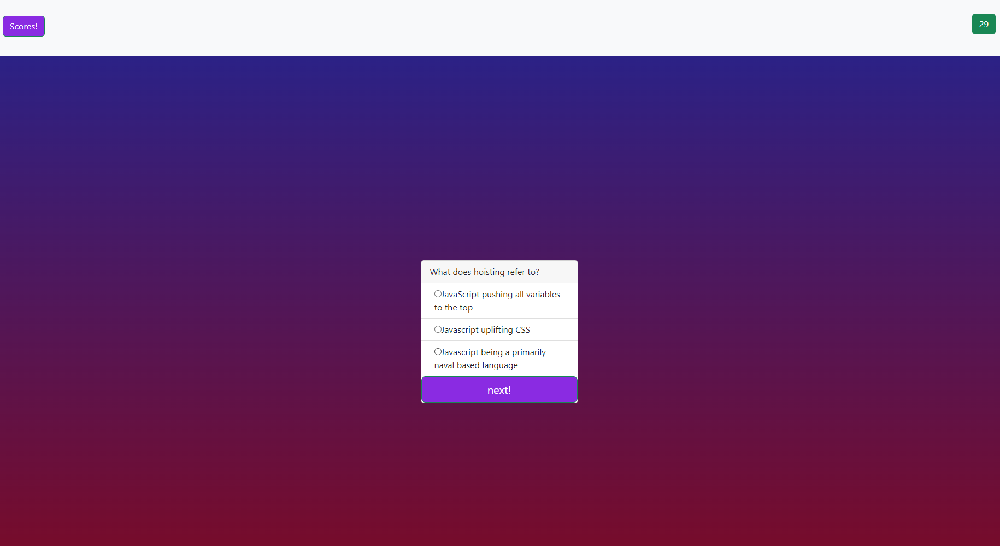

# riddling
  

- [Installation](#installation)

- [Usage](#usage)

- [Contribution](#contributing)

- [License](#license)

## License

a quiz webapp!

 

## Installation

simply open the website in the browser!

## Usage

enter the website, enjoy!
 

## Contributing

please do not contribute

## Testing

click on every element whenever you like

 

## Questions

Contact me!

Github: https://github.com/azrazel95

Email: beni.sprenger@hotmail.com

